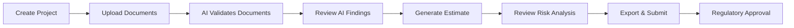
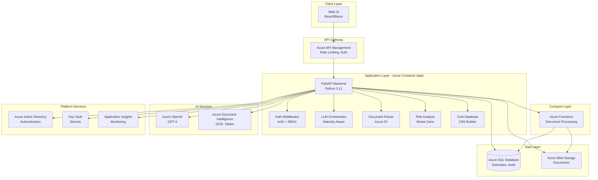
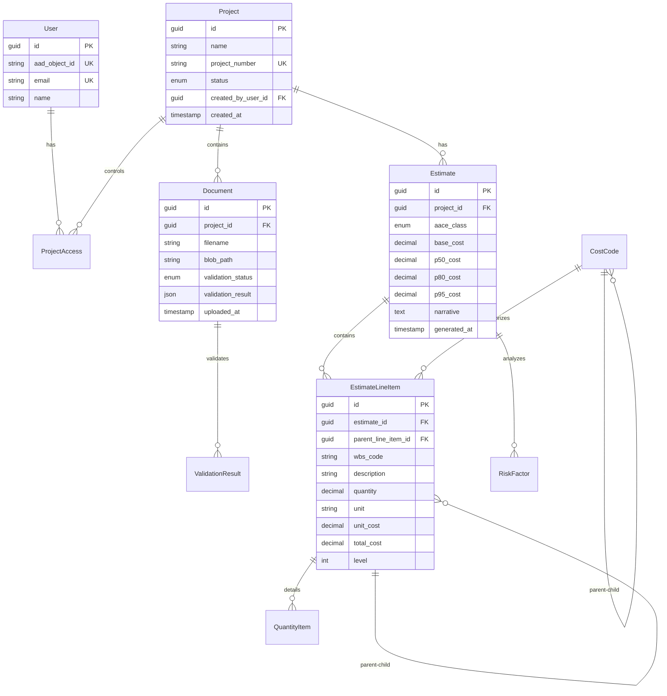
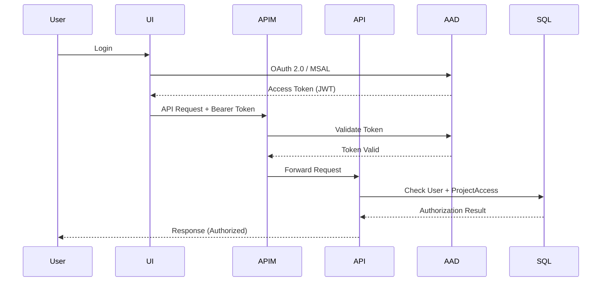

# APEX Architecture Documentation
**AI-Powered Estimation Expert for Utility Transmission & Distribution Projects**

---

## Document Control

| Attribute | Value |
|-----------|-------|
| **Version** | 1.0 |
| **Last Updated** | 2024-11-21 |
| **Status** | UAT Ready |
| **Owner** | [Your Name/Team] |
| **Audience** | Enterprise Architects, Platform Owners, Security Teams, Development Teams |

---

## Executive Summary

### What is APEX?

APEX (AI-Powered Estimation Expert) is an enterprise-grade estimation platform that automates cost estimation for utility transmission and distribution (T&D) projects using artificial intelligence. The platform transforms a manual, labor-intensive estimation process into an intelligent, auditable, and regulatory-compliant workflow.

### Business Value Proposition

**Current State (Without APEX):**
- Manual document review taking 2-4 weeks per estimate
- Inconsistent cost estimation across 30-person estimating team
- Limited risk analysis capabilities
- Difficult to audit and justify estimates for regulatory submissions
- High dependency on senior estimator expertise

**Future State (With APEX):**
- Automated document ingestion and validation in hours, not weeks
- AI-powered consistency with AACE-compliant classification
- Industrial-grade Monte Carlo risk analysis (10,000+ simulations)
- Complete audit trail for ISO-NE regulatory compliance
- Democratized access to expert-level estimation capabilities

**Quantifiable Benefits:**
- **70% reduction** in estimate turnaround time
- **Consistent quality** across all estimators (junior to senior)
- **Regulatory compliance** built-in (audit trails, AACE standards)
- **Risk-adjusted estimates** with P50/P80/P95 confidence levels
- **Scalable** to entire utility estimation portfolio

---

## System Context

### Primary Users

| User Role | Count | Primary Activities |
|-----------|-------|-------------------|
| **Cost Estimators** | ~30 | Create estimates, upload documents, review AI validations |
| **Estimation Managers** | ~5 | Review estimates, approve submissions, audit quality |
| **Regulatory Auditors** | ~3 | Validate compliance, review audit trails, inspect methodologies |

### User Journey



### Key Workflows

1. **Document Ingestion**
   - Upload RFPs, specs, drawings (PDF/Word/Excel)
   - AI parses using Azure Document Intelligence
   - Structured data extraction (quantities, materials, costs)

2. **Validation & Gap Analysis**
   - AI checks completeness vs. AACE requirements
   - Identifies contradictions, missing data, ambiguities
   - Flags high-risk assumptions for human review

3. **Cost Estimation**
   - AI classifies estimate maturity (AACE Class 1-5)
   - Routes to appropriate LLM persona (0.0-0.7 temperature)
   - Builds hierarchical Cost Breakdown Structure (CBS/WBS)

4. **Risk Analysis**
   - Monte Carlo simulation (Latin Hypercube Sampling)
   - Correlation handling (Iman-Conover method)
   - Sensitivity analysis (Spearman rank correlation)
   - Outputs: P50, P80, P95 confidence levels

5. **Export & Audit**
   - Generate PDF/Excel reports
   - Complete audit trail in relational database
   - Regulatory submission package

---

## Architectural Principles

### 1. Zero Trust Security
- All Azure services behind private endpoints
- Managed Identity authentication (no secrets in code)
- Application-level RBAC (AAD token + ProjectAccess + AppRole)
- Complete audit logging for regulatory compliance

### 2. Cloud-Native Design
- Stateless architecture (Azure Container Apps)
- Serverless document processing (Azure Functions)
- Auto-scaling based on demand
- Infrastructure as Code (Bicep/Terraform)

### 3. AI-First Philosophy
- LLM orchestration tailored to estimate maturity (AACE classes)
- Human-in-the-loop for high-risk decisions
- Explainable AI (audit trail of all AI decisions)
- Cost-optimized token usage (smart truncation, caching)

### 4. Data Integrity
- Relational-first design (no JSON blobs for analytical data)
- Normalized cost breakdown structures (CBS/WBS)
- Backend-agnostic UUID handling (GUID TypeDecorator)
- Immutable audit trails

### 5. Regulatory Compliance
- ISO-NE submission requirements built-in
- AACE International standards compliance
- Complete provenance of all estimates
- Retention policies for audit periods

---

## High-Level Architecture

### System Components



### Trust Boundaries

1. **Public Internet ↔ Azure APIM**
   - TLS 1.3 encryption
   - OAuth 2.0 / Azure AD authentication
   - Rate limiting, DDoS protection

2. **APIM ↔ Container Apps**
   - Private VNet communication
   - Managed Identity authentication
   - No public endpoints

3. **Container Apps ↔ Data/AI Services**
   - Azure Backbone network (no internet egress)
   - Managed Identity for all connections
   - Private endpoints for SQL, Blob, Key Vault

---

## Technology Stack

### Core Platform

| Component | Technology | Version | Rationale |
|-----------|-----------|---------|-----------|
| **Language** | Python | 3.11+ | Type hints, async support, mature Azure SDK |
| **API Framework** | FastAPI | 0.104+ | Modern async, auto-docs, Pydantic validation |
| **Database** | Azure SQL Database | Business Critical | Enterprise features, Managed Identity, HA/DR |
| **ORM** | SQLAlchemy | 2.0+ | Mature, async support, cross-DB compatibility |
| **Migrations** | Alembic | 1.13+ | Industry standard, schema versioning |
| **Storage** | Azure Blob Storage | V12 SDK | Massive scalability, lifecycle policies |
| **LLM** | Azure OpenAI | GPT-4 Turbo | Latest model, 128K context, Azure integration |
| **Document AI** | Azure Document Intelligence | 2024-02-29 | Best-in-class OCR, table extraction |
| **Runtime** | Azure Container Apps | Latest | Serverless containers, auto-scale, low cost |

### Data Science & Risk Analysis

| Component | Technology | Purpose |
|-----------|-----------|---------|
| **NumPy** | 1.26+ | Array operations, numerical computing |
| **SciPy** | 1.11+ | Latin Hypercube Sampling, distributions |
| **Statsmodels** | 0.14+ | Correlation analysis, Spearman rank |
| **SALib** | 1.4.7+ | Sensitivity analysis (Sobol, Morris) |

**Prohibited:** `mcerp` (outdated, NumPy incompatible), `PyPDF2` for extraction (use only for simple ops)

### Security & Observability

| Component | Technology | Purpose |
|-----------|-----------|---------|
| **Authentication** | Azure AD | User identity, SSO integration |
| **Authorization** | Custom RBAC | Project-level access control |
| **Secrets** | Azure Key Vault | Configuration secrets (optional) |
| **Monitoring** | Application Insights | Distributed tracing, metrics, logs |
| **Logging** | Structured JSON | Correlation IDs, contextual data |

---

## Logical Architecture

### Layered Design

```
┌─────────────────────────────────────────────────────┐
│              API Layer (FastAPI)                    │
│  ┌──────────┐  ┌──────────┐  ┌──────────┐          │
│  │ Projects │  │Documents │  │Estimates │          │
│  │   API    │  │   API    │  │   API    │          │
│  └──────────┘  └──────────┘  └──────────┘          │
└─────────────────────────────────────────────────────┘
                        ↓
┌─────────────────────────────────────────────────────┐
│            Services Layer (Business Logic)          │
│  ┌────────────┐  ┌──────────┐  ┌──────────┐        │
│  │    LLM     │  │ Document │  │   Risk   │        │
│  │Orchestrator│  │  Parser  │  │ Analysis │        │
│  └────────────┘  └──────────┘  └──────────┘        │
│  ┌────────────┐  ┌──────────┐                      │
│  │    Cost    │  │   AACE   │                      │
│  │  Database  │  │Classifier│                      │
│  └────────────┘  └──────────┘                      │
└─────────────────────────────────────────────────────┘
                        ↓
┌─────────────────────────────────────────────────────┐
│         Data Access Layer (Repositories)            │
│  ┌──────────┐  ┌──────────┐  ┌──────────┐          │
│  │ Project  │  │ Document │  │ Estimate │          │
│  │   Repo   │  │   Repo   │  │   Repo   │          │
│  └──────────┘  └──────────┘  └──────────┘          │
└─────────────────────────────────────────────────────┘
                        ↓
┌─────────────────────────────────────────────────────┐
│              Data Layer (ORM Models)                │
│  SQLAlchemy ORM → Azure SQL Database                │
│  Azure Blob Storage → Document Binaries             │
└─────────────────────────────────────────────────────┘
```

### Key Design Patterns

1. **Repository Pattern**
   - Abstracts data access logic
   - Testable without database
   - Consistent CRUD operations + pagination

2. **Dependency Injection**
   - FastAPI native DI for services
   - Database sessions injected per request
   - Auto-commit/rollback lifecycle

3. **Strategy Pattern (LLM Orchestrator)**
   - Different AI personas per AACE class
   - Temperature ranges: 0.0 (deterministic) to 0.7 (creative)
   - Token management per strategy

4. **Service Layer**
   - No business logic in API controllers
   - Orchestration of cross-cutting concerns
   - Reusable across API and background jobs

---

## Core Service Components

### 1. LLM Orchestrator (Maturity-Aware AI)

**Purpose:** Route AI tasks to appropriate GPT-4 persona based on estimate maturity.

**AACE Classification Mapping:**

| AACE Class | Maturity Level | Temperature | Persona | Use Cases |
|------------|----------------|-------------|---------|-----------|
| **Class 5** | Conceptual (±50%) | 0.7 | Conceptual Estimator | High-level budget ranges, order-of-magnitude |
| **Class 4** | Feasibility (±30%) | 0.3 | Feasibility Analyst | Scope validation, gap identification |
| **Class 3** | Budget (±20%) | 0.1 | Budget Estimator | Quantity extraction, detailed assumptions |
| **Class 2** | Control (±15%) | 0.0 | Control Estimator | Contractor bid analysis |
| **Class 1** | Bid/Check (±10%) | 0.0 | Auditor | Cross-checking, regulatory compliance |

**Key Features:**
- **Token Management:** Pre-flight counting with `tiktoken`, smart truncation
- **Context Window:** 128K tokens (GPT-4 Turbo) with 4K response buffer
- **Caching:** Prompt templates cached, dynamic content interpolated
- **Cost Optimization:** Batching, deduplication, early termination

**Implementation Location:** `src/apex/services/llm/orchestrator.py`

### 2. Document Parser (Azure Document Intelligence)

**Purpose:** Extract structured data from complex construction documents.

**Document Types Supported:**
- **PDF:** Scanned/digital via Azure Document Intelligence (mandatory)
- **Word (.docx):** python-docx library
- **Excel (.xlsx):** openpyxl library
- **Images:** OCR via Azure Document Intelligence

**Processing Pipeline:**
```
Upload → Blob Storage → Azure DI Analysis → Structured JSON →
  → Validation → Database → AI Review
```

**Async Polling Pattern:**
- Non-blocking analysis (long-running documents)
- Configurable timeout (default: 60s)
- Retry with exponential backoff (2-10s intervals)

**Extracted Entities:**
- Line items with quantities, units, costs
- Tables (material lists, cost breakdowns)
- Key-value pairs (project metadata)
- Layout structure (sections, headers)

**Implementation Location:** `src/apex/services/document_parser.py`

### 3. Risk Analysis Engine (Monte Carlo)

**Purpose:** Industrial-grade probabilistic cost estimation.

**Core Algorithm:**
1. **Sampling:** Latin Hypercube Sampling (LHS) for variance reduction
2. **Distributions:** Triangular, Normal, Lognormal, PERT
3. **Correlation:** Iman-Conover rank correlation preservation
4. **Sensitivity:** Spearman rank correlation coefficients

**Configuration:**
- Default: 10,000 iterations
- Adjustable per estimate complexity
- Deterministic seeding for reproducibility

**Outputs:**
- P50 (median cost)
- P80 (80th percentile - typical contingency basis)
- P95 (95th percentile - high-risk threshold)
- Sensitivity rankings (top cost drivers)
- Tornado diagrams (data for visualization)

**⚠️ Human Review Required:**
- `_apply_iman_conover()` correlation implementation must be validated against commercial tools (@RISK, Crystal Ball) before production use
- Test with known distributions and verify correlation matrices

**Implementation Location:** `src/apex/services/risk_analysis.py`

### 4. AACE Classifier

**Purpose:** Determine estimate maturity level per AACE International standards.

**Classification Criteria:**

| Factor | Weight | Class 5 | Class 4 | Class 3 | Class 2 | Class 1 |
|--------|--------|---------|---------|---------|---------|---------|
| Documentation Completeness | 40% | <30% | 30-60% | 60-85% | 85-95% | >95% |
| Design Maturity | 30% | Conceptual | Prelim Design | Detailed Design | Final Design | As-Built |
| Quantity Detail | 20% | Rough | Parametric | Semi-detailed | Detailed | Priced Bids |
| Estimator Experience | 10% | Junior | Mid-level | Senior | Expert | Auditor |

**Output:**
- AACE Class (1-5)
- Confidence score
- Justification narrative
- Recommended contingency range

**Implementation Location:** `src/apex/services/aace_classifier.py`

### 5. Cost Database Service (CBS Builder)

**Purpose:** Build hierarchical Cost Breakdown Structure (CBS/WBS).

**Hierarchy Pattern:**
```
10: Transmission Line (Parent)
  ├─ 10-100: Tangent Structures (Child)
  ├─ 10-200: Deadend Structures (Child)
  └─ 10-300: Conductors (Child)
```

**Database Schema:**
- `EstimateLineItem` table with `parent_line_item_id` foreign key
- `wbs_code` for deterministic parent mapping
- Deferred GUID linking (handle circular dependencies)

**⚠️ Human Review Required:**
- Verify CBS hierarchy persistence logic in `EstimateRepository.create_estimate_with_hierarchy()`
- Test with complex nested structures (5+ levels deep)

**Implementation Location:** `src/apex/services/cost_database.py`

---

## Data Model

### Core Entities



### Key Design Decisions

**1. GUID Type Decorator (Cross-Database Compatibility)**
```python
class GUID(TypeDecorator):
    """
    - SQL Server: UNIQUEIDENTIFIER
    - PostgreSQL: UUID
    - SQLite: CHAR(36) for testing
    """
```

**2. Relational First (No JSON Blobs for Analytics)**
- ✅ **Allowed:** Audit trails (`AuditLog.details`), validation results
- ❌ **Prohibited:** Cost line items, risk factors, quantities in JSON

**3. Hierarchical Line Items**
- Self-referencing foreign key: `parent_line_item_id`
- Deterministic ordering: `wbs_code` (e.g., "10-200")
- Level tracking for UI rendering

**4. Audit Trail (Regulatory Compliance)**
```sql
CREATE TABLE AuditLog (
    id UNIQUEIDENTIFIER PRIMARY KEY,
    entity_type VARCHAR(50),
    entity_id UNIQUEIDENTIFIER,
    action VARCHAR(50),
    user_id UNIQUEIDENTIFIER,
    timestamp DATETIME2,
    details NVARCHAR(MAX) -- JSON for flexibility
);
```

---

## Security Architecture

### Authentication Flow



### Authorization Model (Application RBAC)

**3-Tier Authorization:**

1. **Azure AD Token (Authentication)**
   - Validates user identity
   - Insufficient for data access alone

2. **User Table (Account Activation)**
   - Links AAD Object ID to internal User ID
   - Tracks user metadata, preferences

3. **ProjectAccess + AppRole (Authorization)**
   - `ProjectAccess`: Per-project permissions (READ, WRITE, ADMIN)
   - `AppRole`: Application-wide roles (Estimator, Manager, Auditor)

**Enforcement Point:**
```python
@router.get("/projects/{project_id}")
async def get_project(
    project_id: UUID,
    current_user: User = Depends(get_current_user),
    db: Session = Depends(get_db)
):
    # Check project access
    access = db.query(ProjectAccess).filter_by(
        user_id=current_user.id,
        project_id=project_id
    ).first()

    if not access or access.permission_level not in ["READ", "WRITE", "ADMIN"]:
        raise HTTPException(403, "Insufficient permissions")

    # Proceed with business logic
```

### Managed Identity (Zero Secrets)

**All Azure Service Connections Use Managed Identity:**

| Service | Connection Method | No Secrets |
|---------|------------------|------------|
| Azure SQL Database | `Authentication=ActiveDirectoryMsi` | ✅ |
| Azure Blob Storage | `DefaultAzureCredential()` | ✅ |
| Azure OpenAI | `DefaultAzureCredential()` | ✅ |
| Azure Document Intelligence | `DefaultAzureCredential()` | ✅ |
| Azure Key Vault | `DefaultAzureCredential()` | ✅ |

**Database Connection String:**
```python
mssql+pyodbc://@{server}/{database}?driver=ODBC+Driver+18+for+SQL+Server&Authentication=ActiveDirectoryMsi
```

**Prohibited:**
- ❌ Connection strings with passwords
- ❌ API keys in code or config files
- ❌ Service principal secrets (use Managed Identity)

### Network Security

**VNet Injection:**
- Container Apps in dedicated subnet
- Private endpoints for all data services
- No public internet egress required

**Defense in Depth:**
1. Azure Firewall (network layer)
2. APIM policies (application layer)
3. Application RBAC (data layer)
4. Audit logging (detection layer)

---

## Operational Design

### Deployment Architecture

**Environment Strategy:**
- **Development:** Single Container App + SQL Database (Basic tier)
- **UAT:** 2 Container App replicas + SQL Standard tier
- **Production:** 3+ replicas + SQL Business Critical (HA/DR)

**Azure Resources:**
```
Resource Group: rg-apex-prod
├── Container App: ca-apex-api-prod
├── SQL Server: sql-apex-prod.database.windows.net
│   └── Database: apex-prod (Business Critical)
├── Storage Account: stapexprod (Standard)
│   ├── Container: uploads
│   ├── Container: processed
│   └── Container: dead-letter-queue
├── OpenAI: openai-apex-prod (GPT-4 Turbo)
├── Document Intelligence: di-apex-prod
├── Key Vault: kv-apex-prod (optional)
└── Application Insights: appi-apex-prod
```

### CI/CD Pipeline (Azure DevOps)

**Build Pipeline:**
```yaml
trigger:
  - main
  - release/*

stages:
  - stage: Build
    jobs:
      - job: BuildAndTest
        steps:
          - task: UsePythonVersion@0
            inputs:
              versionSpec: '3.11'
          - script: pip install -e .
          - script: pytest tests/ --cov=apex --cov-report=xml
          - script: black --check src/ tests/
          - script: isort --check src/ tests/
          - script: flake8 src/ tests/
          - task: PublishCodeCoverageResults@1
          - task: PublishTestResults@2
```

**Release Pipeline:**
```yaml
stages:
  - stage: UAT
    jobs:
      - deployment: DeployToUAT
        environment: APEX-UAT
        strategy:
          runOnce:
            deploy:
              steps:
                - task: AzureContainerApps@1
                  inputs:
                    imageToDeploy: acr.azurecr.io/apex:$(Build.BuildId)

  - stage: Production
    dependsOn: UAT
    condition: and(succeeded(), eq(variables['Build.SourceBranch'], 'refs/heads/main'))
    jobs:
      - deployment: DeployToProduction
        environment: APEX-Production
        strategy:
          runOnce:
            deploy:
              steps:
                - task: AzureContainerApps@1
                  inputs:
                    imageToDeploy: acr.azurecr.io/apex:$(Build.BuildId)
```

### Monitoring & Observability

**Application Insights Integration:**
- Structured logging (JSON format)
- Correlation IDs (request tracking)
- Custom metrics (LLM token usage, document parse time)
- Distributed tracing (end-to-end latency)

**Key Metrics to Monitor:**
- API response times (p50, p95, p99)
- LLM token usage (cost tracking)
- Document parse success rate
- Monte Carlo execution time
- Database query performance

**Alerting Thresholds:**
- API availability < 99.5%
- Response time p95 > 5 seconds
- Error rate > 1%
- LLM cost > $X per day
- Database CPU > 80%

### Disaster Recovery

**Backup Strategy:**
- SQL Database: Point-in-time restore (7-35 days)
- Blob Storage: Soft delete (7 days), versioning enabled
- Configuration: Infrastructure as Code (Bicep) in Git

**RTO/RPO:**
- Recovery Time Objective (RTO): 4 hours
- Recovery Point Objective (RPO): 1 hour (SQL automated backups)

---

## Non-Functional Requirements

### Performance

| Metric | Target | Measured At |
|--------|--------|------------|
| API Response Time (p95) | < 2 seconds | APIM egress |
| Document Parse Time | < 30 seconds per document | Azure Function |
| Estimate Generation | < 5 minutes end-to-end | API response |
| Monte Carlo Simulation | < 60 seconds (10K iterations) | Service layer |
| Concurrent Users | 100 simultaneous | Container Apps |

### Scalability

- **Horizontal:** Auto-scale Container Apps (1-10 replicas)
- **Vertical:** SQL Database can scale to 128 vCores
- **Storage:** Virtually unlimited (Blob Storage)
- **LLM:** Rate limits managed by Azure OpenAI quotas

### Reliability

- **Availability:** 99.5% uptime (UAT), 99.9% (Production)
- **Retries:** Exponential backoff for transient failures
- **Circuit Breakers:** Prevent cascading failures to Azure services
- **Graceful Degradation:** Estimate generation works without LLM (reduced features)

### Cost Efficiency

**Estimated Monthly Costs (Production):**
- Container Apps: $200/month (2 vCPUs, 4GB RAM)
- SQL Database (Business Critical): $1,500/month
- Blob Storage: $50/month
- Azure OpenAI: $500-2,000/month (usage-based)
- Document Intelligence: $300-1,000/month (usage-based)
- **Total: $2,550-4,750/month**

**Cost Optimization Strategies:**
- Use GPT-4 Turbo (cheaper than GPT-4)
- Cache document parse results
- Batch LLM calls where possible
- Auto-scale down during off-hours

### Maintainability

- **Code Quality:** Black, isort, flake8 enforced in CI
- **Test Coverage:** Target 70%+ (currently 13% infrastructure only)
- **Documentation:** Architecture docs, API docs (OpenAPI), inline comments
- **Dependency Management:** `pyproject.toml` single source of truth
- **Database Migrations:** Alembic for schema versioning

---

## Compliance & Governance

### ISO-NE Regulatory Requirements

**Audit Trail Requirements:**
1. All estimate inputs (documents, user actions) logged
2. All AI decisions (LLM prompts/responses, validations) recorded
3. All cost calculations (base cost, risk adjustments) traceable
4. All user access (who viewed/edited which projects) tracked

**APEX Compliance Mechanisms:**
- `AuditLog` table captures all CRUD operations
- Document uploads stored immutably in Blob Storage
- LLM interactions logged to Application Insights
- Database change tracking enabled (temporal tables)

### Data Privacy

- **No PII:** Cost estimates are corporate data, not personal
- **Data Residency:** All data in Azure US regions (East US, West US)
- **Retention:** 7-year retention for regulatory audits
- **Export:** Users can export all project data (GDPR-like)

### Security Controls

| Control | Implementation | Status |
|---------|---------------|--------|
| **Authentication** | Azure AD + OAuth 2.0 | ✅ Implemented |
| **Authorization** | Application RBAC | ✅ Implemented |
| **Encryption at Rest** | Azure SQL TDE, Blob Storage | ✅ Default |
| **Encryption in Transit** | TLS 1.3 | ✅ Enforced |
| **Network Isolation** | Private Endpoints | 🔄 UAT Phase |
| **Secret Management** | Managed Identity (no secrets) | ✅ Implemented |
| **Vulnerability Scanning** | Dependabot, Trivy | 🔄 CI Pipeline |
| **Penetration Testing** | Annual 3rd party | 📅 Pre-Production |

---

## Risk Register

### Technical Risks

| Risk | Impact | Probability | Mitigation |
|------|--------|------------|------------|
| **LLM Hallucinations** | High | Medium | Human-in-the-loop validation, confidence scoring |
| **Azure OpenAI Throttling** | Medium | Low | Retry logic, fallback to cached results |
| **Monte Carlo Correlation Bug** | High | Medium | **HUMAN REVIEW REQUIRED** - Validate against @RISK |
| **Document Parse Failure** | Medium | Medium | Graceful degradation, manual upload option |
| **SQL Database Downtime** | High | Low | Business Critical tier with HA, automated backups |

### Business Risks

| Risk | Impact | Probability | Mitigation |
|------|--------|------------|------------|
| **User Adoption Resistance** | High | Medium | Change management, training, pilot program |
| **Cost Overruns (AI)** | Medium | Medium | Usage quotas, cost alerts, token optimization |
| **Regulatory Rejection** | High | Low | ISO-NE engagement during design, pilot submissions |
| **Data Quality Issues** | Medium | High | Validation layer, data quality dashboards |

### Operational Risks

| Risk | Impact | Probability | Mitigation |
|------|--------|------------|------------|
| **Single Developer Dependency** | High | High | Documentation, knowledge transfer, modular design |
| **Azure Service Deprecation** | Medium | Low | Use stable/LTS services, monitor Azure roadmap |
| **Skill Gap (Monte Carlo)** | Medium | Medium | Training, external consultants, code review |

---

## Future Enhancements (Post-MVP)

**Not for Initial UAT Release:**

1. **Concurrency Control**
   - `EstimateStatus` enum (DRAFT, GENERATING, COMPLETE)
   - Prevent parallel estimate generation

2. **Caching Layer**
   - Redis for cost code lookups
   - Reduce database load

3. **Rate Limiting**
   - Token bucket algorithm for LLM calls
   - Prevent runaway costs

4. **Custom Telemetry**
   - Estimate duration histograms
   - Parse time by document type

5. **Background Jobs**
   - Azure Service Bus + Functions
   - Async document processing queue

6. **Natural Language Interface**
   - ChatGPT-style query interface
   - "What's the cost of similar transmission projects?"

---

## Appendix

### Glossary

| Term | Definition |
|------|-----------|
| **AACE** | Association for the Advancement of Cost Engineering - International standards body |
| **CBS** | Cost Breakdown Structure - Hierarchical cost categorization |
| **WBS** | Work Breakdown Structure - Project decomposition |
| **ISO-NE** | Independent System Operator - New England (regulatory body) |
| **P50/P80/P95** | Percentile confidence levels in Monte Carlo analysis |
| **Managed Identity** | Azure AD identity for services (no credentials needed) |
| **Iman-Conover** | Statistical method for preserving correlation in sampling |

### Reference Documents

1. AACE International Recommended Practice 18R-97: *Cost Estimate Classification System*
2. Azure Container Apps Documentation: [Microsoft Learn](https://learn.microsoft.com/azure/container-apps/)
3. Azure OpenAI Service: [Microsoft Learn](https://learn.microsoft.com/azure/ai-services/openai/)
4. FastAPI Documentation: [fastapi.tiangolo.com](https://fastapi.tiangolo.com/)
5. SQLAlchemy 2.0 Documentation: [docs.sqlalchemy.org](https://docs.sqlalchemy.org/)

### Contact Information

| Role | Contact |
|------|---------|
| **Product Owner** | [Your Name/Email] |
| **Technical Lead** | [Your Name/Email] |
| **Enterprise Architect** | [IT Contact] |
| **Security Contact** | [Security Team] |

---

**Document Version History:**

| Version | Date | Author | Changes |
|---------|------|--------|---------|
| 1.0 | 2024-11-21 | [Your Name] | Initial architecture documentation for UAT review |

---

*This architecture document serves as the authoritative reference for APEX design, implementation, and deployment decisions.*
