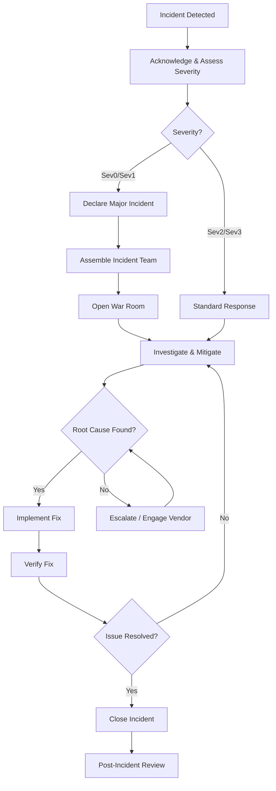

# APEX Incident Response Playbook

**Version:** 1.0
**Last Updated:** 2024
**Owner:** DevOps Team / SRE Team
**Purpose:** Incident response procedures, troubleshooting guides, and escalation paths

## Overview

This playbook provides structured incident response procedures for the APEX platform. It ensures rapid incident resolution, clear communication, and continuous improvement through post-incident reviews.

**Incident Severity Levels:**

| Severity | Impact | Response Time | Examples |
|----------|--------|---------------|----------|
| **Sev0 (Critical)** | Complete service outage, data loss risk | <15 minutes | All users unable to access system, database corruption |
| **Sev1 (High)** | Major functionality impaired, multiple users affected | <1 hour | Estimation generation failing, document upload errors |
| **Sev2 (Medium)** | Minor functionality impaired, workaround available | <4 hours | Slow performance, intermittent errors for specific features |
| **Sev3 (Low)** | Cosmetic issues, single user affected | <24 hours | UI rendering issues, minor bugs |

**Incident Response Team:**
- **Incident Commander:** On-call engineer
- **Technical Lead:** Application owner / architect
- **Database Admin:** For database-related incidents
- **Security Team:** For security incidents
- **Communications Lead:** Stakeholder notification

---

## Table of Contents

1. [Incident Response Process](#incident-response-process)
2. [Common Incident Scenarios](#common-incident-scenarios)
3. [Troubleshooting Guides](#troubleshooting-guides)
4. [Escalation Paths](#escalation-paths)
5. [Communication Templates](#communication-templates)
6. [Post-Incident Review](#post-incident-review)

---

## Incident Response Process

### 1.1 Incident Detection

**Detection Methods:**
- Application Insights alerts (PagerDuty, email, Slack)
- User reports (help desk tickets, email)
- Proactive monitoring (dashboard review)
- External monitoring (Azure Service Health)

**Initial Actions (Within 5 Minutes):**

1. **Acknowledge Alert:**
   - Respond to PagerDuty alert
   - Post acknowledgment in #apex-incidents Slack channel

2. **Assess Severity:**
   - Check dashboard for impact scope (all users vs. specific feature)
   - Review error count and affected endpoints
   - Determine severity using table above

3. **Create Incident Record:**
   ```
   Incident ID: INC-<YYYYMMDD>-<sequence>
   Severity: Sev0/Sev1/Sev2/Sev3
   Start Time: <timestamp>
   Detected By: <alert name / user report>
   Symptoms: <brief description>
   ```

---

### 1.2 Incident Response Workflow



**Incident Commander Responsibilities:**

- Coordinate technical response
- Make rollback decisions
- Communicate status updates
- Delegate tasks to team members
- Escalate as needed
- Lead post-incident review

---

### 1.3 Major Incident Declaration (Sev0/Sev1)

**When to Declare:**
- Service completely unavailable (Sev0)
- Data loss or corruption risk (Sev0)
- Security breach suspected (Sev0)
- >50% of users affected (Sev1)
- Critical business function impaired (Sev1)

**Declaration Procedure:**

1. **Announce in Slack:**
   ```
   @here MAJOR INCIDENT DECLARED - Sev0/Sev1

   Incident ID: INC-<YYYYMMDD>-<sequence>
   Summary: <brief description>
   Impact: <user impact>
   Status: INVESTIGATING

   War Room: https://zoom.us/j/apex-incident
   Incident Commander: @<on-call-engineer>
   ```

2. **Open War Room:**
   - Start Zoom bridge: https://zoom.us/j/apex-incident
   - Share link in #apex-incidents channel
   - All hands on deck

3. **Assemble Team:**
   - On-call engineer (Incident Commander)
   - Technical Lead
   - DBA (if database-related)
   - Security Team (if security-related)
   - Communications Lead

4. **Start Incident Log:**
   ```
   Incident ID: INC-20240115-001
   Severity: Sev0
   Start Time: 2024-01-15 14:23:00 UTC
   Incident Commander: John Doe

   Timeline:
   14:23 - Alert received: High error rate (>50%)
   14:25 - Major incident declared
   14:26 - War room opened
   14:28 - Team assembled, investigation started
   [Continue logging all actions and decisions]
   ```

---

### 1.4 Mitigation Priority

**Immediate Actions (First 15 Minutes):**

1. **Stop the Bleeding:**
   - Rollback recent deployments (if applicable)
   - Disable problematic features (feature flags)
   - Scale up resources (if capacity issue)
   - Shift traffic away from failing components

2. **Preserve Evidence:**
   - Capture logs before any changes
   - Take database backup (if corruption suspected)
   - Export Application Insights traces
   - Screenshot error states

3. **Communicate Status:**
   - Update stakeholders every 30 minutes
   - Update status page (if public-facing)
   - Post updates in #apex-incidents

**Investigation (After Mitigation):**

1. **Analyze Logs:**
   - Application Insights exceptions
   - Container App logs
   - Database query logs
   - Network traces (if applicable)

2. **Reproduce Issue (if safe):**
   - In staging environment
   - With isolated test data
   - Document repro steps

3. **Identify Root Cause:**
   - 5 Whys analysis
   - Check recent changes (code, config, infrastructure)
   - Review dependencies (Azure Service Health)

---

### 1.5 Resolution & Closure

**Resolution Criteria:**

- All health checks passing
- Error rate <1% for 30 minutes
- User-reported issues resolved
- Root cause identified (or incident closed as "monitoring")

**Closure Procedure:**

1. **Verify Fix:**
   - Run smoke tests (see RUNBOOK.md)
   - Confirm with affected users (if applicable)
   - Monitor for 30-60 minutes

2. **Update Incident Record:**
   ```
   Resolution Time: <timestamp>
   Duration: <minutes>
   Root Cause: <brief description>
   Fix Applied: <description>
   Verification: <smoke test results>
   ```

3. **Close Alerts:**
   - Resolve PagerDuty alert
   - Close Azure Monitor alerts (if manually created)

4. **Communicate Resolution:**
   ```
   INCIDENT RESOLVED - INC-20240115-001

   Summary: High error rate due to database connection pool exhaustion
   Resolution: Increased connection pool size from 50 to 200
   Duration: 47 minutes (14:23 - 15:10 UTC)
   User Impact: ~30 users unable to generate estimates

   Post-Incident Review scheduled for: <date/time>
   ```

5. **Schedule Post-Incident Review:**
   - Within 48 hours of resolution
   - Mandatory for Sev0/Sev1 incidents
   - See Section 6 for RCA template

---

## Common Incident Scenarios

### 2.1 Scenario: Complete Service Outage

**Symptoms:**
- All API endpoints returning 503
- Health checks failing
- Application Insights showing 0 requests

**Immediate Diagnostic Steps:**

```bash
# Check Container App status
az containerapp show \
  --name apex-backend-prod \
  --resource-group apex-rg-prod \
  --query "properties.runningStatus"

# Check replica count
az containerapp revision show \
  --name apex-backend-prod \
  --resource-group apex-rg-prod \
  --revision <CURRENT_REVISION> \
  --query "properties.replicas"

# Check for recent deployments
az containerapp revision list \
  --name apex-backend-prod \
  --resource-group apex-rg-prod \
  --query "[].{Name:name, Created:properties.createdTime, Active:properties.active}" \
  -o table
```

**Common Root Causes:**

| Cause | Diagnostic | Resolution |
|-------|-----------|------------|
| Container crashes on startup | `az containerapp logs show` shows startup errors | Fix application code, redeploy |
| Health check failures | `/health/ready` returning 500 | Check database/blob connectivity |
| Resource exhaustion | Memory/CPU at 100% | Scale up Container App |
| Bad deployment | Recent revision created | Rollback to previous revision |
| Infrastructure outage | Azure Service Health alerts | Contact Azure Support, communicate ETA |

**Resolution Flowchart:**

```
1. Check replica count
   └─ If 0 replicas:
      ├─ Check Container App logs for crash loop
      ├─ Fix code or config issue
      └─ Redeploy or rollback

2. Check health endpoints
   └─ If health checks failing:
      ├─ Test database connection
      ├─ Test blob storage connection
      └─ Fix connectivity issues (Private Endpoint, Managed Identity)

3. Check recent deployments
   └─ If bad deployment:
      └─ Rollback immediately (see RUNBOOK.md)
```

---

### 2.2 Scenario: High Error Rate (>10%)

**Symptoms:**
- Error rate spike in Application Insights
- Multiple 500 errors on specific endpoints
- Users reporting "something went wrong" errors

**Immediate Diagnostic Steps:**

```kusto
// Get error distribution
exceptions
| where timestamp > ago(15m)
| summarize ErrorCount = count() by type, method
| order by ErrorCount desc
| take 10

// Get affected endpoints
requests
| where timestamp > ago(15m) and success == false
| summarize FailureCount = count() by name, resultCode
| order by FailureCount desc
```

**Common Root Causes:**

| Cause | Diagnostic | Resolution |
|-------|-----------|------------|
| Database timeout | Exception type: `SqlException` | Investigate slow queries, scale database |
| LLM rate limiting | Exception type: `RateLimitError` | Implement retry backoff, request quota increase |
| Blob storage throttling | Exception type: `BlobStorageException` | Implement exponential backoff |
| Null reference error | Exception type: `NullReferenceException` | Hotfix code, add null checks |
| External API failure | Dependencies showing errors | Contact vendor, implement circuit breaker |

**Resolution Priority:**

1. **Immediate (Sev0):**
   - If error rate >50%: Rollback deployment
   - If external dependency: Enable circuit breaker / failover

2. **Short-term (Sev1):**
   - If database timeout: Add index, optimize query
   - If rate limiting: Implement backoff, cache results

3. **Long-term (Sev2):**
   - Add defensive programming (null checks, validation)
   - Improve error handling and retry logic

---

### 2.3 Scenario: Database Connection Failures

**Symptoms:**
- `Cannot connect to database` errors
- Timeouts on database queries
- Health check `/health/ready` returning `database: unhealthy`

**Immediate Diagnostic Steps:**

```bash
# Check SQL Server status
az sql server show \
  --name sql-apex-prod \
  --resource-group apex-rg-prod \
  --query "{State: state, FullyQualifiedDomainName: fullyQualifiedDomainName}"

# Check Private Endpoint connection
az network private-endpoint show \
  --name pe-sql-apex-prod \
  --resource-group apex-rg-prod \
  --query "privateLinkServiceConnections[0].privateLinkServiceConnectionState"

# Test DNS resolution from Container App
az containerapp exec \
  --name apex-backend-prod \
  --resource-group apex-rg-prod \
  --command "nslookup sql-apex-prod.database.windows.net"
```

**Common Root Causes:**

| Cause | Diagnostic | Resolution |
|-------|-----------|------------|
| Private Endpoint disconnected | Connection state: "Rejected" or "Disconnected" | Recreate Private Endpoint connection |
| Managed Identity permissions lost | RBAC check fails | Re-assign SQL DB Contributor role |
| NSG blocking traffic | Port 1433 blocked | Update NSG rules |
| Connection pool exhaustion | All connections in use | Increase pool size in connection string |
| Database overloaded | DTU at 100% | Scale up database tier |

**Resolution Steps:**

```bash
# 1. Verify Private Endpoint approved
az network private-endpoint connection approve \
  --id <connection-id> \
  --description "Emergency reconnection"

# 2. Re-assign Managed Identity permissions
export PRINCIPAL_ID=$(az containerapp show \
  --name apex-backend-prod \
  --resource-group apex-rg-prod \
  --query "identity.principalId" -o tsv)

az role assignment create \
  --assignee "$PRINCIPAL_ID" \
  --role "SQL DB Contributor" \
  --scope "/subscriptions/<sub-id>/resourceGroups/apex-rg-prod/providers/Microsoft.Sql/servers/sql-apex-prod"

# 3. Verify NSG allows SQL traffic
az network nsg rule show \
  --nsg-name container-apps-nsg \
  --resource-group apex-rg-prod \
  --name AllowSqlTraffic

# 4. Restart Container App (if connection pool exhausted)
az containerapp restart \
  --name apex-backend-prod \
  --resource-group apex-rg-prod
```

---

### 2.4 Scenario: Blob Storage Access Denied (403)

**Symptoms:**
- Document upload failures
- 403 Forbidden errors from blob storage
- `BlobStorageException: Insufficient permissions`

**Immediate Diagnostic Steps:**

```bash
# Check Storage Account status
az storage account show \
  --name stapexprod \
  --resource-group apex-rg-prod \
  --query "{Status: statusOfPrimary, AllowBlobPublicAccess: allowBlobPublicAccess}"

# Check Managed Identity RBAC
az role assignment list \
  --assignee "$PRINCIPAL_ID" \
  --scope "/subscriptions/<sub-id>/resourceGroups/apex-rg-prod/providers/Microsoft.Storage/storageAccounts/stapexprod" \
  --query "[].{Role: roleDefinitionName, Scope: scope}"

# Test blob access from Container App
az containerapp exec \
  --name apex-backend-prod \
  --resource-group apex-rg-prod \
  --command "python3 -c '
from apex.azure.blob_storage import BlobStorageClient
client = BlobStorageClient()
print(client.list_containers())
'"
```

**Common Root Causes:**

| Cause | Diagnostic | Resolution |
|-------|-----------|------------|
| Managed Identity RBAC missing | Role assignment not found | Assign "Storage Blob Data Contributor" |
| Private Endpoint disconnected | Connection state: "Rejected" | Recreate Private Endpoint |
| Public network access disabled | AllowBlobPublicAccess: false | Verify Container App uses VNet |
| Incorrect container name | Container not found | Fix container name in config |

**Resolution Steps:**

```bash
# Re-assign Storage Blob Data Contributor role
az role assignment create \
  --assignee "$PRINCIPAL_ID" \
  --role "Storage Blob Data Contributor" \
  --scope "/subscriptions/<sub-id>/resourceGroups/apex-rg-prod/providers/Microsoft.Storage/storageAccounts/stapexprod"

# Verify Private Endpoint
az network private-endpoint show \
  --name pe-storage-apex-prod \
  --resource-group apex-rg-prod \
  --query "privateLinkServiceConnections[0].privateLinkServiceConnectionState.status"

# Test blob upload
az containerapp exec \
  --name apex-backend-prod \
  --resource-group apex-rg-prod \
  --command "python3 -c '
from apex.azure.blob_storage import BlobStorageClient
client = BlobStorageClient()
client.upload_blob(\"uploads\", \"test.txt\", b\"test content\")
print(\"Upload successful\")
'"
```

---

### 2.5 Scenario: LLM Service Degradation

**Symptoms:**
- Document validation taking >60 seconds
- Azure OpenAI returning 429 (rate limit) or 503 (service unavailable)
- Estimate generation failures

**Immediate Diagnostic Steps:**

```kusto
// Check LLM call performance
dependencies
| where timestamp > ago(30m)
| where type == "HTTP" and target contains "openai.azure.com"
| summarize
    CallCount = count(),
    AvgDuration = avg(duration),
    P95Duration = percentile(duration, 95),
    FailureRate = (countif(success == false) * 100.0) / count()
| extend
    AvgDurationSec = round(AvgDuration / 1000.0, 2),
    P95DurationSec = round(P95Duration / 1000.0, 2)

// Check for rate limiting errors
exceptions
| where timestamp > ago(30m)
| where type contains "RateLimitError" or type contains "TooManyRequests"
| summarize count()
```

**Common Root Causes:**

| Cause | Diagnostic | Resolution |
|-------|-----------|------------|
| Rate limiting (Tokens Per Minute) | 429 errors in logs | Implement retry backoff, request quota increase |
| Service degradation | Azure Service Health alerts | Wait for service recovery, use cached responses |
| Circuit breaker open | BusinessRuleViolation: "CIRCUIT_BREAKER_OPEN" | Wait for circuit breaker cooldown (10 minutes) |
| Token quota exhausted | Monthly quota exceeded | Request emergency quota increase |

**Resolution Steps:**

**Short-term Mitigation:**

```python
# Enable circuit breaker cooldown bypass (emergency only)
# In document_parser.py:
# Temporarily reduce circuit breaker threshold from 5 to 10 failures

# Implement aggressive caching for repeated requests
# Cache LLM validation results for 1 hour (instead of per-request)
```

**Long-term Fix:**

```bash
# Request Azure OpenAI quota increase
az cognitiveservices account update \
  --name openai-apex-prod \
  --resource-group apex-rg-prod \
  --sku S0 \
  --kind OpenAI

# Or contact Azure Support for emergency quota increase
```

---

### 2.6 Scenario: Slow Performance (P95 >5s)

**Symptoms:**
- Dashboard shows P95 response time >5s
- Users reporting "slow loading"
- No specific errors, but gradual degradation

**Immediate Diagnostic Steps:**

```kusto
// Identify slowest endpoints
requests
| where timestamp > ago(30m)
| summarize
    CallCount = count(),
    P95Duration = percentile(duration, 95)
    by name
| where CallCount > 10
| order by P95Duration desc
| take 10

// Check dependency performance
dependencies
| where timestamp > ago(30m)
| summarize
    CallCount = count(),
    P95Duration = percentile(duration, 95)
    by target, type
| order by P95Duration desc
| take 10
```

**Common Root Causes:**

| Cause | Diagnostic | Resolution |
|-------|-----------|------------|
| Database query slow | SQL dependency >500ms | Add index, optimize query |
| LLM calls slow | OpenAI dependency >10s | Reduce LLM context size, cache results |
| Memory pressure | Container memory >80% | Scale up memory limit |
| CPU throttling | Container CPU >80% | Scale up CPU allocation |
| Network latency | High P95 on dependencies | Investigate network path |

**Resolution Priority:**

```bash
# 1. Quick wins (within minutes):
# - Restart Container App (clears memory leaks)
az containerapp restart \
  --name apex-backend-prod \
  --resource-group apex-rg-prod

# 2. Scale up resources (within 5 minutes):
az containerapp update \
  --name apex-backend-prod \
  --resource-group apex-rg-prod \
  --cpu 4.0 \
  --memory 8Gi \
  --min-replicas 3 \
  --max-replicas 15

# 3. Database optimization (within 1 hour):
# - Identify slow queries via Application Insights
# - Add missing indexes
# - Update statistics
```

---

## Troubleshooting Guides

### 3.1 Application Won't Start

**Symptoms:**
- Container App shows 0 replicas
- Logs show crash loop or startup errors

**Diagnostic Checklist:**

- [ ] **Check startup logs:**
  ```bash
  az containerapp logs show \
    --name apex-backend-prod \
    --resource-group apex-rg-prod \
    --tail 100 \
    | grep -i "error\|exception\|fatal"
  ```

- [ ] **Verify environment variables:**
  ```bash
  az containerapp show \
    --name apex-backend-prod \
    --resource-group apex-rg-prod \
    --query "properties.template.containers[0].env" -o table
  ```

- [ ] **Test dependencies (database, blob storage):**
  ```bash
  # From another container in the same VNet
  nc -zv sql-apex-prod.database.windows.net 1433
  nc -zv stapexprod.blob.core.windows.net 443
  ```

- [ ] **Check health endpoints (from outside):**
  ```bash
  curl -v https://apex-backend-prod.azurecontainerapps.io/health/live
  ```

**Common Issues:**

| Error Pattern | Root Cause | Solution |
|---------------|-----------|----------|
| `ModuleNotFoundError: No module named 'apex'` | Python package not installed | Rebuild Docker image with correct dependencies |
| `ConnectionRefusedError: [Errno 111] Connection refused` | Database not reachable | Check Private Endpoint, NSG rules |
| `Authentication failed` | Managed Identity not working | Verify identity assigned to Container App |
| `Port 8000 already in use` | Multiple processes trying to bind | Fix Dockerfile CMD / entrypoint |

---

### 3.2 Authentication Failures (401 Unauthorized)

**Symptoms:**
- Users getting "Unauthorized" errors
- Token validation failing

**Diagnostic Checklist:**

- [ ] **Verify Azure AD configuration:**
  ```bash
  az ad app show --id <AZURE_AD_CLIENT_ID> \
    --query "{AppId: appId, DisplayName: displayName}"
  ```

- [ ] **Check token claims:**
  ```bash
  # Decode JWT token (use jwt.io or jwt CLI tool)
  echo "<token>" | jwt decode -

  # Expected claims:
  # - iss: https://sts.windows.net/<tenant-id>/
  # - aud: <client-id>
  # - oid: <user-object-id>
  ```

- [ ] **Verify JWKS endpoint reachable:**
  ```bash
  curl "https://login.microsoftonline.com/<tenant-id>/discovery/v2.0/keys"

  # Expected: JSON with "keys" array
  ```

- [ ] **Check Container App logs for JWT validation errors:**
  ```bash
  az containerapp logs show \
    --name apex-backend-prod \
    --resource-group apex-rg-prod \
    --tail 50 \
    | grep -i "jwt\|token\|auth"
  ```

**Common Issues:**

| Error | Root Cause | Solution |
|-------|-----------|----------|
| `Token has expired` | Token TTL exceeded (default 1 hour) | Refresh token on client side |
| `Invalid issuer` | Wrong tenant ID in config | Verify AZURE_AD_TENANT_ID |
| `Invalid audience` | Wrong client ID in token | Verify token audience matches AZURE_AD_CLIENT_ID |
| `Signature verification failed` | JWKS cache stale or wrong key | Restart Container App to refresh JWKS cache |

---

### 3.3 Document Upload/Parsing Failures

**Symptoms:**
- Document upload returns 500 error
- Parsing timeout (>60 seconds)
- Circuit breaker open

**Diagnostic Checklist:**

- [ ] **Check blob storage access:**
  ```bash
  az containerapp exec \
    --name apex-backend-prod \
    --resource-group apex-rg-prod \
    --command "python3 -c '
  from apex.azure.blob_storage import BlobStorageClient
  client = BlobStorageClient()
  print(client.upload_blob(\"uploads\", \"test.txt\", b\"test\"))
  '"
  ```

- [ ] **Check Document Intelligence service status:**
  ```bash
  az cognitiveservices account show \
    --name di-apex-prod \
    --resource-group apex-rg-prod \
    --query "{State: properties.provisioningState, Endpoint: properties.endpoint}"
  ```

- [ ] **Review parsing logs:**
  ```kusto
  traces
  | where timestamp > ago(30m)
  | where message contains "DocumentParser" or message contains "Azure Document Intelligence"
  | order by timestamp desc
  ```

**Common Issues:**

| Error | Root Cause | Solution |
|-------|-----------|----------|
| `Circuit breaker is OPEN` | Too many failures (≥5 in 10 min) | Wait 10 minutes for cooldown, or manually reset |
| `Timeout waiting for document analysis` | Large PDF or service slow | Increase timeout to 120s, retry |
| `Unsupported file format` | Non-PDF/DOCX/XLSX file | Return 400 Bad Request with clear message |
| `BlobStorageException: Blob not found` | Blob upload failed silently | Check blob storage logs |

---

### 3.4 Estimate Generation Failures

**Symptoms:**
- Estimate generation API returning 500
- LLM calls timing out
- Monte Carlo simulation errors

**Diagnostic Checklist:**

- [ ] **Check LLM service availability:**
  ```kusto
  dependencies
  | where timestamp > ago(15m)
  | where target contains "openai.azure.com"
  | summarize FailureCount = countif(success == false), TotalCount = count()
  | extend FailureRate = (FailureCount * 100.0) / TotalCount
  ```

- [ ] **Review estimate generation logs:**
  ```kusto
  traces
  | where timestamp > ago(30m)
  | where message contains "EstimateGenerator" or message contains "MonteCarloRiskAnalyzer"
  | order by timestamp desc
  ```

- [ ] **Check for data quality issues:**
  ```sql
  -- Run in Azure Data Studio
  SELECT COUNT(*) FROM estimate_line_items WHERE total_cost IS NULL;
  SELECT COUNT(*) FROM estimate_risk_factors WHERE distribution NOT IN ('triangular', 'normal', 'uniform');
  ```

**Common Issues:**

| Error | Root Cause | Solution |
|-------|-----------|----------|
| `MonteCarloRiskAnalyzer: Invalid distribution` | Unsupported distribution in risk factors | Validate risk factors before passing to analyzer |
| `LLMOrchestrator: Token limit exceeded` | Document too large (>128K tokens) | Implement smart truncation in orchestrator |
| `CostDatabaseService: No cost codes found` | Empty cost_codes table | Seed database with RSMeans cost codes |
| `EstimateRepository: Integrity constraint violation` | Duplicate WBS codes or orphaned line items | Fix CBS hierarchy building logic |

---

## Escalation Paths

### 4.1 Escalation Matrix

| Issue Type | Level 1 (L1) | Level 2 (L2) | Level 3 (L3) |
|------------|--------------|--------------|--------------|
| **Application Errors** | On-call engineer | Technical Lead | Engineering Manager |
| **Database Issues** | On-call engineer | DBA Team | Database Manager |
| **Infrastructure Issues** | On-call engineer | Cloud Team | Cloud Architect |
| **Security Issues** | On-call engineer | Security Team | CISO |
| **Vendor Issues (Azure)** | On-call engineer | Azure Support (Premier) | Microsoft TAM |

### 4.2 Escalation Timing

| Severity | Escalation Trigger | Escalate To |
|----------|-------------------|-------------|
| Sev0 | Immediately upon declaration | Technical Lead + L2 |
| Sev1 | After 30 minutes without resolution | Technical Lead |
| Sev2 | After 2 hours without resolution | Technical Lead (next business day) |
| Sev3 | After 24 hours without resolution | Technical Lead (weekly sync) |

### 4.3 Contact Information

**On-Call Rotation:**
- PagerDuty: https://company.pagerduty.com/schedules#APEX
- Primary On-Call: See PagerDuty schedule
- Secondary On-Call (backup): See PagerDuty schedule

**Key Contacts:**

| Role | Name | Email | Phone | Escalation Hours |
|------|------|-------|-------|------------------|
| Technical Lead |  | tech-lead@company.com |  | 24/7 for Sev0 |
| Engineering Manager |  | eng-mgr@company.com |  | Business hours |
| DBA Team |  | dba-team@company.com |  | 24/7 |
| Security Team |  | security@company.com |  | 24/7 for Sev0 |
| Cloud Team |  | cloud-ops@company.com |  | 24/7 |

**Vendor Contacts:**

- **Azure Support:** Premier Support Portal - https://portal.azure.com/#view/Microsoft_Azure_Support
- **Microsoft TAM:**  -
- **PagerDuty Support:** support@pagerduty.com

---

## Communication Templates

### 5.1 Initial Incident Notification (Sev0/Sev1)

**To:** Stakeholders (estimator team, managers, auditors)
**Subject:** [INCIDENT] APEX Service Degradation - Sev0/Sev1

```
APEX users,

We are currently experiencing a service issue affecting [describe functionality].

Impact: [All users / Specific features]
Status: INVESTIGATING
Start Time: <timestamp>

We are actively working to resolve this issue and will provide updates every 30 minutes.

For urgent inquiries, please contact:
- On-Call Engineer: <email>
- Help Desk: help-desk@company.com

We apologize for the inconvenience.

APEX Operations Team
```

### 5.2 Status Update (Every 30 Minutes for Sev0/Sev1)

**Subject:** [UPDATE] APEX Service Issue - <time>

```
Status Update: <timestamp>

Current Status: [INVESTIGATING / MITIGATING / FIXING / MONITORING]

Progress:
- [Action taken 1]
- [Action taken 2]
- [Current investigation area]

User Impact: [Describe current impact]

Next Update: In 30 minutes (<timestamp>)

APEX Operations Team
```

### 5.3 Incident Resolution Notification

**Subject:** [RESOLVED] APEX Service Issue - Sev0/Sev1

```
APEX users,

The service issue affecting [functionality] has been RESOLVED.

Summary:
- Incident ID: INC-<ID>
- Start Time: <timestamp>
- Resolution Time: <timestamp>
- Duration: <minutes>

Root Cause: <brief description>

Resolution: <description of fix applied>

Affected Users: <number> users experienced [impact]

We apologize for the disruption. A post-incident review will be conducted to prevent recurrence.

Post-Incident Review findings will be shared within 48 hours.

Thank you for your patience.

APEX Operations Team
```

### 5.4 Post-Incident Review Summary (External)

**Subject:** [PIR] APEX Incident INC-<ID> - Lessons Learned

```
APEX users,

Please find below a summary of the incident that occurred on <date> and the actions we're taking to prevent recurrence.

Incident Summary:
- Incident ID: INC-<ID>
- Severity: Sev0/Sev1
- Duration: <duration>
- User Impact: <description>

Root Cause: <detailed description>

Corrective Actions:
1. [Immediate fix applied]
2. [Process improvement]
3. [Technology improvement]

Timeline:
- <timestamp>: Incident detected
- <timestamp>: Major incident declared
- <timestamp>: Root cause identified
- <timestamp>: Fix applied
- <timestamp>: Incident resolved

Preventative Measures:
- [Action item 1] - Due: <date>
- [Action item 2] - Due: <date>

We are committed to continuous improvement and appreciate your understanding.

Full post-incident review available upon request.

APEX Operations Team
```

---

## Post-Incident Review

### 6.1 Post-Incident Review (PIR) Process

**Timing:** Within 48 hours of incident resolution
**Participants:** Incident Commander, Technical Lead, DBA (if applicable), Management
**Duration:** 60 minutes
**Output:** PIR document, action items

**Agenda:**

1. **Incident Timeline Review** (10 minutes)
   - Walk through timeline from detection to resolution
   - Identify gaps in response

2. **Root Cause Analysis** (20 minutes)
   - 5 Whys methodology
   - Fishbone diagram (if applicable)
   - Contributing factors

3. **What Went Well** (10 minutes)
   - Effective detection methods
   - Successful mitigation tactics
   - Good communication

4. **What Could Be Improved** (15 minutes)
   - Delayed detection
   - Slow escalation
   - Unclear runbooks
   - Missing monitoring

5. **Action Items** (5 minutes)
   - Immediate fixes
   - Process improvements
   - Technology improvements
   - Assign owners and due dates

---

### 6.2 Root Cause Analysis Template

**Incident ID:** INC-<YYYYMMDD>-<sequence>
**Date:** <date>
**Severity:** Sev0/Sev1/Sev2
**Duration:** <minutes>

#### Incident Summary

**What happened:**
<Brief description of the incident>

**User Impact:**
- Number of users affected: <number>
- Functionality impaired: <description>
- Business impact: <revenue loss, SLA breach, etc.>

#### Timeline

| Time | Event | Action Taken |
|------|-------|-------------|
| 14:23 | Alert received: High error rate |  |
| 14:25 | Major incident declared | War room opened |
| 14:28 | Root cause identified: Database connection pool exhausted |  |
| 14:35 | Fix applied: Increased pool size from 50 to 200 |  |
| 14:42 | Verification: Error rate normalized |  |
| 14:50 | Incident resolved | Stakeholders notified |

#### Root Cause Analysis (5 Whys)

**Problem Statement:** Users unable to generate estimates (500 errors)

1. **Why did users get 500 errors?**
   - Because the API failed to query the database

2. **Why did the API fail to query the database?**
   - Because all database connections were in use

3. **Why were all connections in use?**
   - Because connection pool size (50) was too small for peak load

4. **Why was the pool size too small?**
   - Because it was set based on average load, not peak load

5. **Why wasn't peak load accounted for?**
   - Because load testing did not simulate end-of-quarter peak traffic

**Root Cause:** Insufficient connection pool sizing for peak load scenarios

#### Contributing Factors

- Load testing did not simulate peak traffic (end-of-quarter regulatory deadline)
- No monitoring alert for connection pool exhaustion
- Connection pool size hardcoded in config (not dynamic)

#### Corrective Actions

**Immediate (Applied During Incident):**
- [ ] Increased connection pool size from 50 to 200
- [ ] Verified fix with smoke tests

**Short-term (Within 1 Week):**
- [ ] Create monitoring alert for connection pool usage >80% - Owner: DevOps - Due: <date>
- [ ] Add connection pool metrics to dashboard - Owner: SRE - Due: <date>
- [ ] Document connection pool tuning in runbook - Owner: Tech Lead - Due: <date>

**Long-term (Within 1 Month):**
- [ ] Implement dynamic connection pool scaling based on load - Owner: Engineering - Due: <date>
- [ ] Conduct load testing for peak scenarios (end-of-quarter) - Owner: QA - Due: <date>
- [ ] Review all resource limits (CPU, memory, connections) for peak capacity - Owner: Architect - Due: <date>

#### Lessons Learned

**What Went Well:**
- Alert detected issue within 2 minutes
- War room assembled quickly
- Root cause identified in 5 minutes
- Fix applied and verified in <15 minutes

**What Could Be Improved:**
- Load testing should include peak scenarios
- Connection pool metrics should be monitored proactively
- Resource sizing should account for 2x average load

#### Follow-Up

- [ ] Schedule follow-up meeting in 2 weeks to review action item progress
- [ ] Share PIR summary with stakeholders
- [ ] Update runbook with lessons learned

**PIR Approved By:**
- Incident Commander: _______________
- Technical Lead: _______________
- Management: _______________

---

## Document Control

| Version | Date | Author | Changes |
|---------|------|--------|---------|
| 1.0 | 2024 | DevOps Team | Initial incident response playbook |

**Approval:**
- SRE Lead: _______________
- Technical Lead: _______________
- Operations Manager: _______________

---

**END OF INCIDENT RESPONSE PLAYBOOK**
